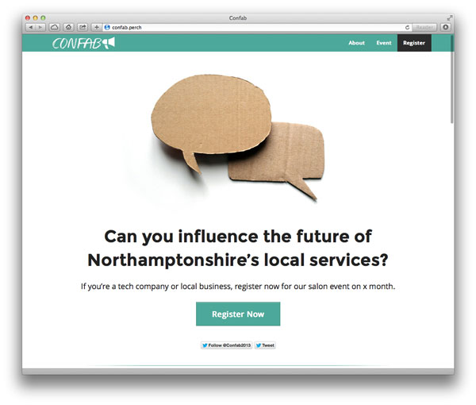
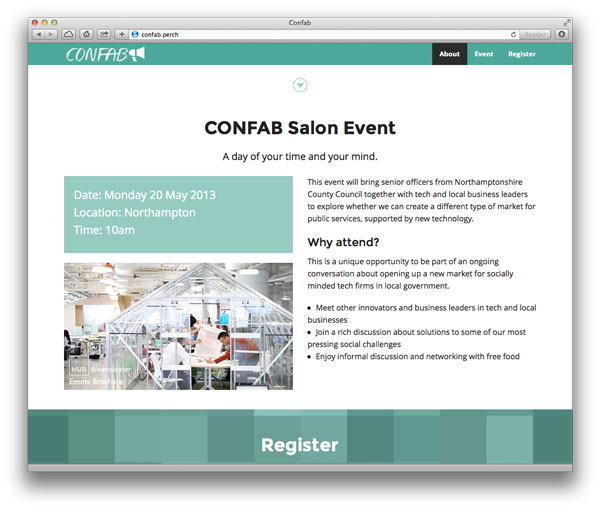

## CONFAB ##

For a time at www.confabsalon.org, CONFAB was a project with Northamptonshire County Council and [Poached Creative](http://www.poachedcreative.com/).

* The site runs on [Perch CMS](https://grabaperch.com/) - you would need to [buy a licence](https://grabaperch.com/buy) to run it. 
* The front end was built off the [Zurb](http://foundation.zurb.com/) framework, and depends on the Zurb Foundation gem (version 4).

## Licence

You are free to use the design and theme, but please don't use the name Confab, or Confab Salon, in any new projects. Please also note that Perch and Zurb Foundation have their own licences.

## Screenshots

